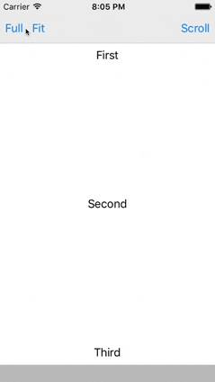
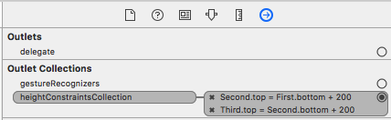

# ContentFitScrollView

[](https://github.com/Carthage/Carthage)
[](http://cocoapods.org/pods/ContentFitScrollView)
[](http://cocoapods.org/pods/ContentFitScrollView)
[](http://cocoapods.org/pods/ContentFitScrollView)
[](https://travis-ci.org/anton-plebanovich/ContentFitScrollView)

Self adjustable Scroll View that proportionally reducing provided height constraints constants to fit all content on screen without scrolling. It takes into account `ContentFitLayoutConstraint`'s `minimumHeight` value. If it's unable to fit content on screen without scrolling it'll just allow scrolling.

`ContentFitScrollView` allows you to layout your content for high resolution screens and be sure that in case there isn't enough space on lower resolution screens content will be scrollable.

## Example

To run the example project, clone the repo, and run `pod install` from the Example directory first.

## GIF animation



## Installation

#### Carthage

Please check [official guide](https://github.com/Carthage/Carthage#if-youre-building-for-ios-tvos-or-watchos)

Cartfile:

```
github "APUtils/ContentFitScrollView"
```

#### CocoaPods

ContentFitScrollView is available through [CocoaPods](http://cocoapods.org). To install
it, simply add the following line to your Podfile:

```ruby
pod 'ContentFitScrollView'
```

## Usage

Just set `ContentFitScrollView` class to UIScrollView in storyboard (usually it's base container): 


and add constraints that you want to be resized in order to fit content for screen:



You can set `ContentFitLayoutConstraint` class for those constraints in order to specify minimum height.

See example project for more details.

## Contributions

Any contribution is more than welcome! You can contribute through pull requests and issues on GitHub.

## Author

Anton Plebanovich, anton.plebanovich@gmail.com

## License

ContentFitScrollView is available under the MIT license. See the LICENSE file for more info.
